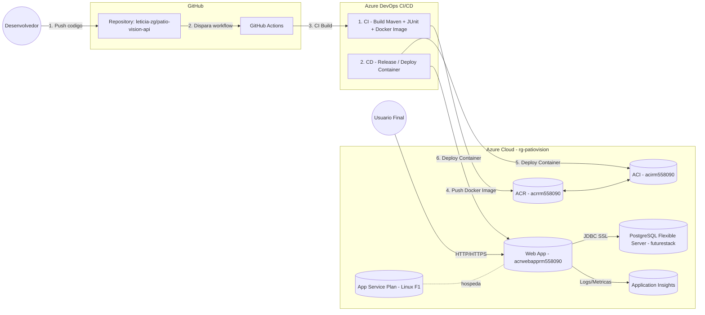

# Arquitetura — Patio Vision (DevOps Tools & Cloud Computing)

## 1) Visão Geral (Componentes e Conexões)

## 2) Fluxo de Deploy (CI/CD)
1. **Developer** faz `git push` para a branch **main** do repositório `leticia-zg/patio-vision-api`.
2. O **GitHub Actions** executa o workflow: compila o projeto Java 17 (Maven/Gradle), gera o JAR e usa o **publish profile** do App Service para publicar no **Web App** `app-pg-rm556219`.
3. O App Service reinicia automaticamente e sobe o container gerenciado com o JAR na porta interna 80.

## 3) Execução em Produção (PaaS)
- O **Web App** roda como PaaS (Linux, Java 17), sem VM gerenciada.
- Conecta no **PostgreSQL Flexible Server** `pg-rm1556219` (DB `patio_vision`) via **JDBC com SSL**.
- Envia métricas e logs para **Application Insights** `ai-pg-rm556219`.
- Usuários acessam via **HTTPS** (`app-pg-rm556219.azurewebsites.net`).

## 4) Variáveis/Configuração Importante
- App Settings no Web App:
  - `SPRING_DATASOURCE_URL=jdbc:postgresql://pg-rm1556219.postgres.database.azure.com:5432/patio_vision?sslmode=require`
  - `SPRING_DATASOURCE_USERNAME=pgadmin`
  - `SPRING_DATASOURCE_PASSWORD=***`
  - `SPRING_PROFILES_ACTIVE=prod`
  - `APPLICATIONINSIGHTS_CONNECTION_STRING=InstrumentationKey=...`

## 5) Segurança e Boas Práticas
- Conexão ao banco com **SSL/TLS** obrigatório (`sslmode=require`).
- Credenciais sensíveis em **Secrets** / **App Settings** (não versionadas).
- Telemetria e tracing via **Application Insights**.
- PaaS reduz superfície de ataque (sem root/SSH exposto para app).

---

**Recursos provisionados:**
- RG: `rg-patio-vision`
- App Service Plan: `plan-pg-rm556219` (Linux F1)
- Web App: `app-pg-rm556219` (Java 17)
- PostgreSQL Flexible Server: `pg-rm1556219` (DB `patio_vision`)
- Application Insights: `ai-pg-rm556219`
