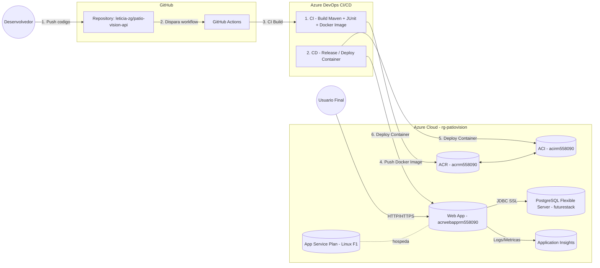

# Arquitetura — Patio Vision (DevOps Tools & Cloud Computing)

## Visão Geral (Componentes e Conexões)

- PostgreSQL Flexible Server: `pg-rm1556219` (DB `patio_vision`)
- Application Insights: `ai-pg-rm556219`
